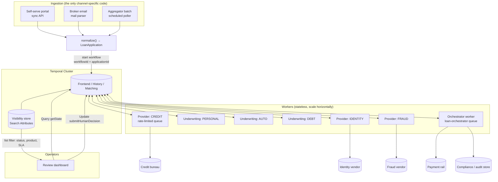
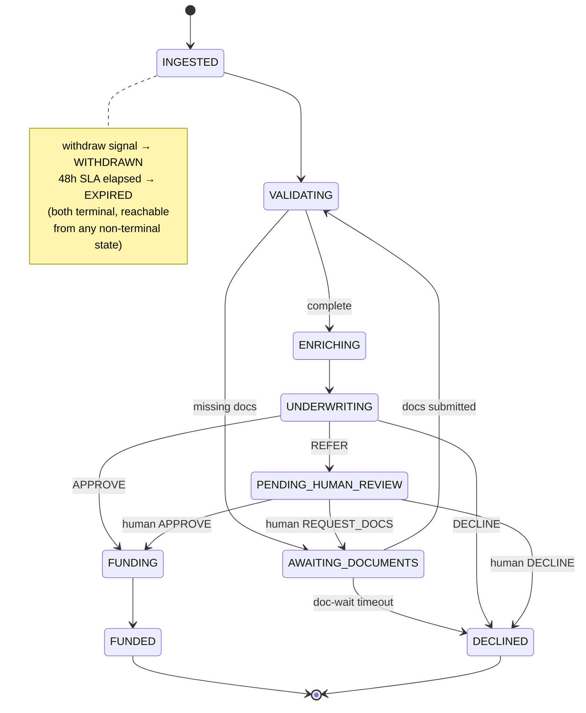
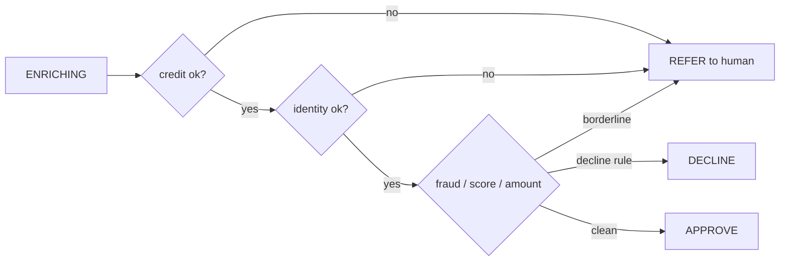
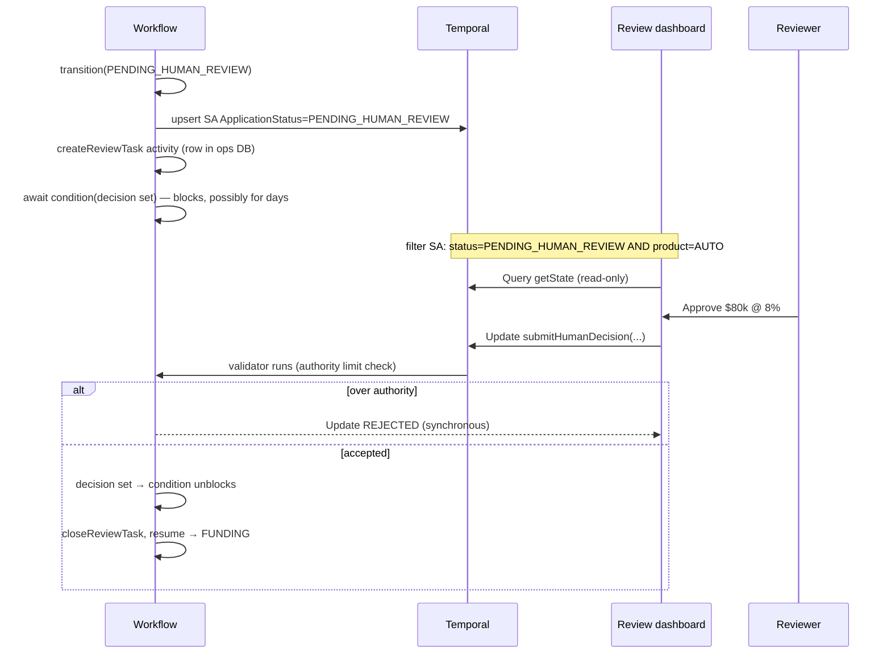
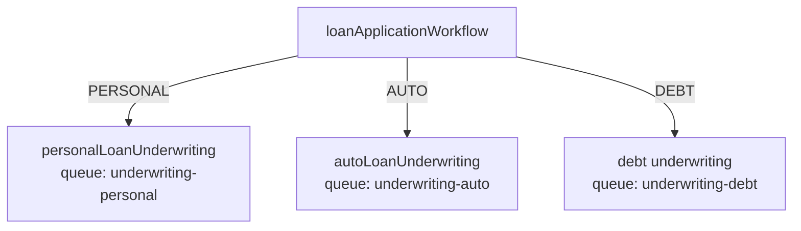

# Loan Disbursement Orchestration on Temporal

A reference architecture for ingesting personal/auto/debt-consolidation loan
applications from three channels and driving each to a terminal state — **funded,
declined, or escalated** — inside a 48-hour SLA, with full auditability and
operator visibility.

---

## 1. The one idea everything hangs off

**Each application is a single, long-running Temporal Workflow, keyed by `applicationId`.**

That one decision buys most of the requirements for free:

| Requirement from the brief | What Temporal gives you |
| --- | --- |
| Every app reaches a terminal state | The workflow function returns exactly one `LoanOutcome`; it can't silently vanish |
| Resume cleanly after a human decision | The workflow durably blocks on an Update/Signal; workers can crash/redeploy and it picks up exactly where it left off |
| Full audit of every decision | The workflow event history is an immutable, replayable log; we mirror it into a compliance store too |
| Operator visibility "where is X right now?" | A `getState` Query + custom Search Attributes |
| Survive third-party outages mid-flow | Activities retry durably with backoff; the workflow just waits |
| Don't lose track / stalls | SLA timers inside the workflow escalate or expire stuck applications |

The workflow code *is* the state machine. Everything else (ingestion, providers,
ops UI) is an adapter around that core.

---

## 2. System architecture



Why separate task queues per **product** and per **provider**? Two reasons:

1. **Blast-radius isolation.** A bad deploy of the auto-loan ruleset, or the
   fraud vendor melting down, is confined to its own worker pool and queue. The
   other products and providers keep flowing.
2. **Independent scaling + rate limiting.** Each provider queue pins a global
   rate limit (`maxTaskQueueActivitiesPerSecond`) that matches the vendor's
   contractual RPS, regardless of how many worker pods are running.

---

## 3. Application lifecycle as a state machine



Terminal states: **FUNDED, DECLINED, WITHDRAWN, EXPIRED**. The workflow can only
return one `LoanOutcome`, so termination is structurally guaranteed.

`src/workflows/loanApplication.workflow.ts` implements this directly: the linear
states are sequential `await`s; `AWAITING_DOCUMENTS` and `PENDING_HUMAN_REVIEW`
are `await condition(...)` blocks; the 48h SLA is a `Promise.race` between the
pipeline and a `sleep(48h)`.

---

## 4. Reliable ingestion from three very different channels

The principle: **channel differences die at the front door.** Each channel has a
thin adapter (`src/client/ingestion.ts`) that produces the canonical
`LoanApplication`, and from then on the system is uniform.

| Channel | Trigger | Idempotency key | Notes |
| --- | --- | --- | --- |
| Portal | Synchronous HTTP → `startApplication` | generated `app-<uuid>`, returned to caller | Caller already structured; lowest trust risk |
| Broker email | Mail-parsing service emits structured event | `app-<uuid>` + raw `messageId` kept for audit | Parser is fallible; metadata preserves the source message for disputes |
| Aggregator batch | A **Temporal Schedule** fans out one `startApplication` per row | **`agg-<aggregator>-<externalId>`** (deterministic) | Re-delivered batches are dedup'd automatically |

The key Temporal mechanic is **`workflowId = applicationId` + a conflict policy**.
A broker that re-sends the same referral, or an aggregator that re-delivers
yesterday's file, hits `workflowIdConflictPolicy: 'USE_EXISTING'` and gets the
existing run back instead of a duplicate. Ingestion becomes naturally
idempotent without a dedupe table.

For the batch channel specifically, a Temporal Schedule running a small
"fan-out" workflow is more robust than a cron job: if the poller dies halfway
through a 5,000-row file, the schedule's own durability and the per-row
idempotency mean re-running is safe.

---

## 5. Workflow definition

`loanApplicationWorkflow(app: LoanApplication): Promise<LoanOutcome>`

Responsibilities, in order:

1. Seed Search Attributes (product, channel, amount, SLA deadline) and register
   handlers for the Query/Updates/Signal.
2. Start the **48h SLA race** — the whole pipeline runs against a `sleep(48h)`;
   whichever finishes first wins. Breach → `EXPIRED`.
3. **VALIDATING** → if docs missing, loop in **AWAITING_DOCUMENTS** waiting on the
   `submitDocuments` Update (with a 24h doc-wait timeout that declines as
   incomplete).
4. **ENRICHING** → fan out the three provider activities concurrently,
   tolerating partial failure (§7).
5. **UNDERWRITING** → delegate to the product's child workflow (§6).
6. Decision loop:
   - `APPROVE` → **FUNDING** → idempotent disbursement → **FUNDED**
   - `DECLINE` → **DECLINED**
   - `REFER` → **PENDING_HUMAN_REVIEW**, block on the human decision (§8); a
     human can approve, decline, or send it back for documents (loops to step 3).

A single `transition(status, detail)` helper is the *only* place status changes:
it updates in-memory state, upserts the `ApplicationStatus` search attribute, and
writes an audit event. One choke point keeps state, visibility, and audit
perfectly in sync.

---

## 6. Activity design

Activities are the only place side effects happen; workflows stay deterministic.

| Activity | Retry posture | Why |
| --- | --- | --- |
| `validateApplication` | Non-retryable on bad data (`ApplicationFailure`) | Malformed input won't fix itself by retrying |
| `pullCreditReport` / `verifyIdentity` / `screenForFraud` | 8 attempts, exp backoff, heartbeat, 10-min schedule-to-close | Ride out transient 5xx and brief outages |
| `disburseFunds` | 20 attempts, **idempotency key = applicationId** | Must never double-disburse even if a result is lost |
| `recordAudit` | 10 attempts | Compliance write must not be dropped |
| `notifyApplicant`, `createReviewTask`, `closeReviewTask`, `emitOutcome` | 10 attempts | Side-channel, safe to retry |

Two activity details that matter in production:

- **Heartbeating** on provider and funding activities. A heartbeat timeout lets
  Temporal detect a hung worker and reschedule on a healthy one, and long
  activities can report progress so a retry resumes rather than restarts.
- **Idempotency keys** on every external write. Activities are *at-least-once*;
  the credit pull, the disbursement, and the notification all need to be safe to
  replay. Disbursement is the dangerous one and uses `applicationId` as the
  payment-rail idempotency key.

---

## 7. Third-party failures, rate limits, and partial failures

Three distinct problems, three distinct mechanisms:

**Transient failures & outages → durable retry.** Each provider call is an
activity with exponential backoff. While a vendor is down, the activity simply
keeps retrying; the workflow waits without consuming a thread or losing state.
The `scheduleToCloseTimeout` (10 min) bounds how long we'll wait before the
provider is treated as unavailable.

**Rate limits → per-provider task queue with a global cap.** Every credit pull
runs on the `provider-credit` queue, whose worker sets
`maxTaskQueueActivitiesPerSecond`. This is a *cluster-wide* ceiling: scale the
worker pods to 1 or 50, the bureau still sees ≤ N rps. No token bucket to build.

**Partial failure → tolerant enrichment + REFER.** Enrichment fans out with
`Promise.all([... .catch(() => null)])`, so a provider that exhausts its retries
yields `null` rather than failing the application. Underwriting then decides
whether a missing signal is **fatal** (decline) or **referable** (a human can
proceed with degraded data). Example from the personal ruleset:

```text
no credit report      → REFER (human can pull manually)
identity unverified   → REFER
credit < 620          → DECLINE
fraud risk ≥ 80       → DECLINE
delinquency / >40k    → REFER
otherwise             → APPROVE
```



---

## 8. Human-in-the-loop: pause and resume seamlessly

When underwriting returns `REFER`:



Why an **Update** rather than a **Signal** for the human decision:

- The Update **returns a result synchronously**, so the dashboard knows
  immediately whether the decision was accepted.
- The Update **validator** enforces invariants *before* the decision enters
  history — e.g. rejecting an approval above the reviewer's authority limit, or a
  decision on an application that isn't actually awaiting review. A Signal is
  fire-and-forget and can't reject.

The "resume seamlessly" property is the headline Temporal feature: the workflow
is `await condition(...)`-blocked. Workers can be redeployed, the box can reboot,
the reviewer can take three days — when the Update finally arrives, execution
continues from the exact point it paused, with all local variables intact. No
saved-state table, no resume logic to write.

A review-SLA timer (4h) wakes the workflow to flag stale reviews (it flips the
`AssignedReviewer` SA to `ESCALATED` and writes an audit event) without
abandoning the wait.

---

## 9. Product isolation

Underwriting for each product is its **own child workflow on its own task queue**:



This gives:

- **Independent deploys & versioning.** Change the auto ruleset and roll out only
  the auto worker. In-flight personal applications are untouched. Workflow
  versioning (`patched()` / Worker Versioning) is scoped per product.
- **Independent scaling.** Debt-consolidation volume spikes? Scale only that pool.
- **Reproducible decisions.** Each ruleset carries a `rulesetVersion`
  (`personal-v3`, `auto-v2`) written into the audit log, so an auditor can
  reconstruct exactly which logic ran.

The rules themselves are pure, deterministic functions of
`(application, enrichment)`, so they run safely inside the child workflow and are
captured verbatim in history. When rules need external data (e.g. a pricing
model or a bureau-specific score cutoff served from config), that lookup becomes
an activity inside the child workflow — the isolation boundary still holds.

---

## 10. Observability — knowing when something is broken

| Need | Mechanism |
| --- | --- |
| "Where is application X?" | `getState` **Query** (no history event, instant) |
| "All AUTO apps stuck in review >2h" | **Search Attribute** list filter in the Temporal UI/CLI |
| Stuck / stalled applications | The 48h SLA `EXPIRED` path + 4h review-SLA escalation surface them automatically |
| Failing providers | Activity failure/retry metrics (Prometheus from the SDK); task-queue **schedule-to-start latency** spiking = worker starvation |
| Why did this decision happen? | Workflow **event history** (full replay) + the external audit store |
| Anything broken at all | Temporal Web UI shows every workflow, its pending activities, retry counts, and the exact failure |

An operator investigating a stuck app: filter the UI by
`ApplicationStatus="PENDING_HUMAN_REVIEW"`, open the workflow, see it's blocked on
`submitHumanDecision`, read the audit/`reasons`, and either reassign the review
task or push the decision via the Update. The history tells them precisely what
ran, what each provider returned, and where it's waiting.

---

## 11. Auditability & compliance

- **Every transition and decision** (automated and human) is written via
  `recordAudit` to an append-only compliance store, including actor
  (`system:underwriting`, `human:<reviewerId>`, provider name), inputs, outputs,
  and ruleset version.
- **Workflow history** is a second, immutable record that can be *replayed* to
  reconstruct the exact execution.
- **PII handling:** sensitive payloads (SSN, documents) should not sit in plain
  text in workflow history. Use a **custom Data Converter / payload codec** to
  encrypt payloads at rest in history, and store documents as object-store
  **references**, never blobs. (The `LoanApplication` type carries `DocumentRef`
  URIs for exactly this reason.)

---

## 12. Scaling 8k → 50k applications/month

50k/month ≈ 1,700/day ≈ a couple per minute at peak — **trivial for Temporal**,
which routinely runs millions of concurrent workflows. The real constraints are:

- **Third-party RPS** — handled by the per-provider rate-limited queues.
- **Worker capacity** — workers are stateless; scale pods horizontally and tune
  `maxConcurrentActivityTaskExecutions` / `maxConcurrentWorkflowTaskExecutions`.
- **Visibility store** — Search Attribute queries hit the visibility DB
  (Elasticsearch/Postgres); keep the attribute set small and indexed (we use 6).

Long stalls aren't a concern: a 48h-bounded workflow with a handful of history
events stays small, so `continue-as-new` isn't needed here.

---

## 13. Trade-offs (the interesting part)

1. **Child workflows per product vs. one workflow with a strategy switch.**
   Chosen: child workflows. Trade-off: more moving parts and inter-workflow
   plumbing, in exchange for true deploy/version/scaling isolation. For a single
   product you'd skip this; with 3+ products and distinct teams it pays for
   itself.

2. **Update vs. Signal for the human decision.** Chosen: Update. Trade-off:
   Updates are a newer API surface and require a slightly more capable client,
   but they give synchronous validation and feedback that a Signal can't. For a
   regulated approval this is worth it.

3. **Temporal Search Attributes vs. a dedicated read-model (CQRS).** Chosen:
   Search Attributes for now. Trade-off: visibility queries are eventually
   consistent and less expressive than SQL. If ops needs rich joins/reporting
   ("avg time-in-review by broker by week"), project workflow state into a
   Postgres read model via an activity. That's a real component to own; I'd add
   it only when the reporting need is concrete.

4. **Long durable retries vs. fail-fast.** Chosen: ride out provider outages with
   bounded retries, backstopped by the 48h SLA. Trade-off: an app can sit in
   `ENRICHING` for minutes during an outage. The alternative (escalate to a human
   immediately on first failure) protects SLA but floods the review queue during
   any vendor blip. The SLA race gives us the best of both — patient, but never
   past 48h.

5. **Missing critical data → REFER vs. DECLINE.** Chosen: REFER. Trade-off: more
   human review volume, but declining someone because *our* vendor was down is
   both bad lending and bad optics. The brief's "non-funded = dead weight"
   pressure argues for keeping borderline apps alive via a human rather than
   auto-killing them.

6. **One workflow per application** is clear and debuggable but creates many
   workflow entities. At this volume that's a non-issue; I'm flagging it only
   because it's the kind of thing that matters at 100× this scale.

7. **PII in history** demands an encryption codec from day one in a bank — easy
   to retrofit technically, painful to retrofit for compliance. I'd build it in
   before go-live, not after.

---

## 14. What I'd build next (not in this cut)

- The encryption **payload codec** and document-reference storage.
- A **read-model projection** for ops reporting if/when needed.
- **Worker Versioning** wired into CI so product rulesets can change without
  breaking in-flight runs.
- A thin **ops UI** (Query + Update are already exposed; it's a CRUD-over-Temporal
  front end).
- Per-environment **Temporal Schedule** definitions for the aggregator fan-out.

See `README.md` to run the workers and the end-to-end demo locally.
