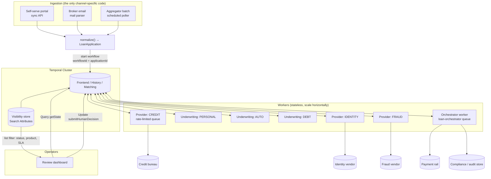
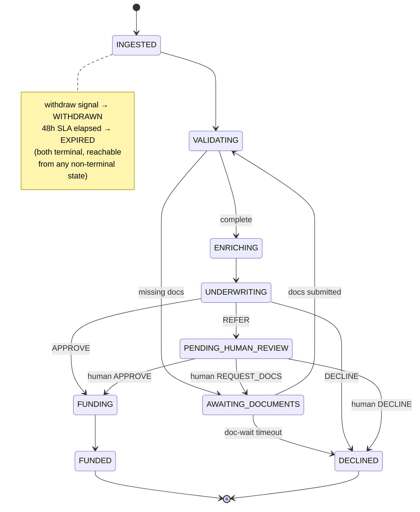
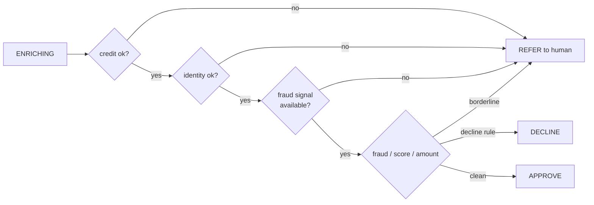
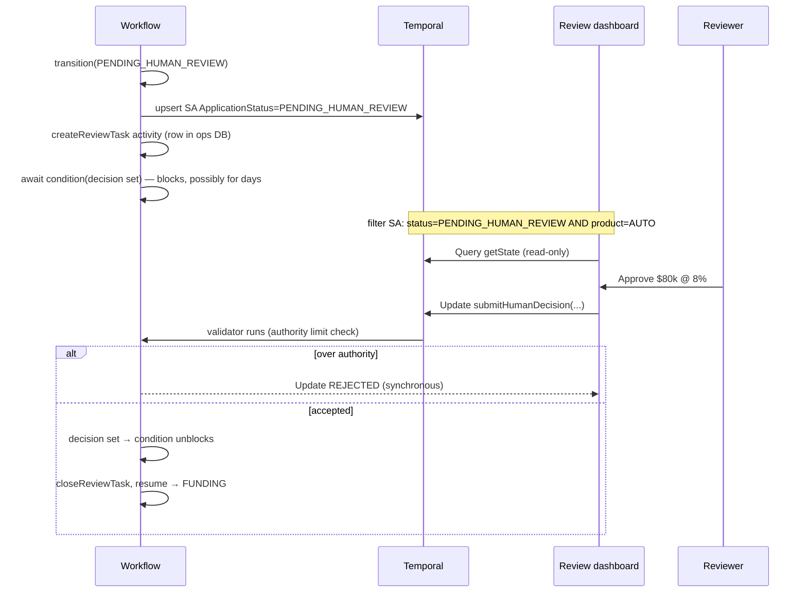
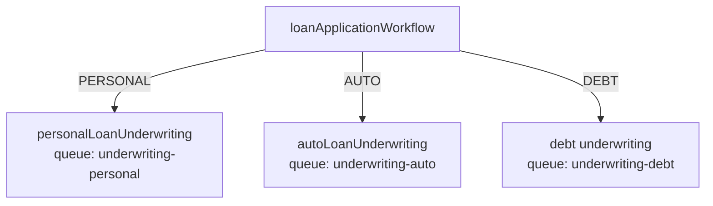
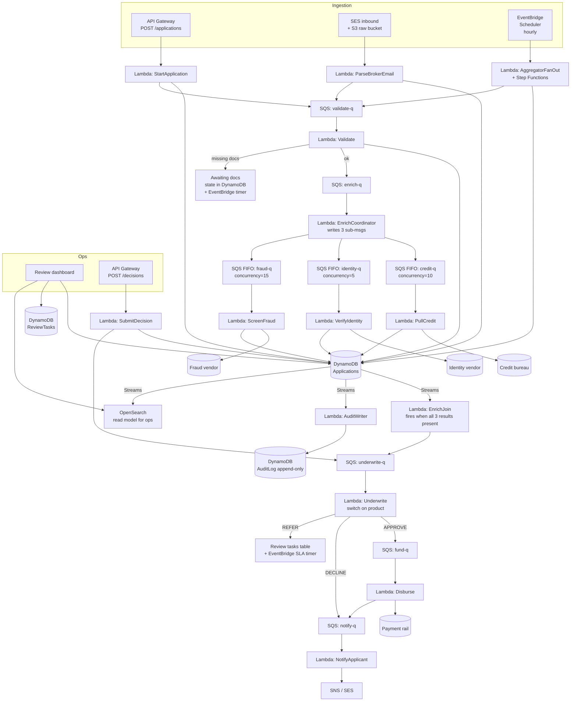
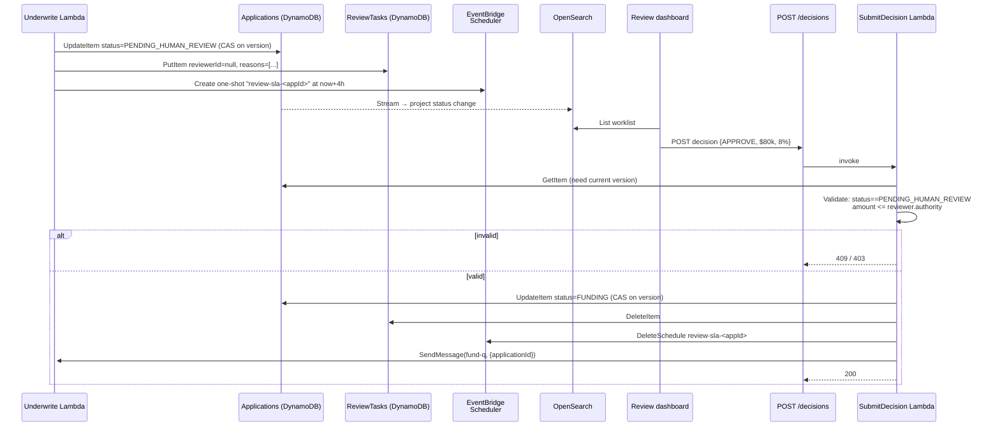

# Loan Disbursement Orchestration on Temporal

A reference architecture for ingesting personal/auto/debt-consolidation loan
applications from three channels and driving each to a terminal state — **funded,
declined, or escalated** — inside a 48-hour SLA, with full auditability and
operator visibility.

---

## 1. The one idea everything hangs off

**Each application is a single, long-running Temporal Workflow, keyed by `applicationId`.**

That one decision buys most of the requirements for free:

| Requirement from the brief | What Temporal gives you |
| --- | --- |
| Every app reaches a terminal state | The workflow function returns exactly one `LoanOutcome`; it can't silently vanish |
| Resume cleanly after a human decision | The workflow durably blocks on an Update/Signal; workers can crash/redeploy and it picks up exactly where it left off |
| Full audit of every decision | The workflow event history is an immutable, replayable log; we mirror it into a compliance store too |
| Operator visibility "where is X right now?" | A `getState` Query + custom Search Attributes |
| Survive third-party outages mid-flow | Activities retry durably with backoff; the workflow just waits |
| Don't lose track / stalls | SLA timers inside the workflow escalate or expire stuck applications |

The workflow code *is* the state machine. Everything else (ingestion, providers,
ops UI) is an adapter around that core.

---

## 2. System architecture



Why separate task queues per **product** and per **provider**? Two reasons:

1. **Blast-radius isolation.** A bad deploy of the auto-loan ruleset, or the
   fraud vendor melting down, is confined to its own worker pool and queue. The
   other products and providers keep flowing.
2. **Independent scaling + rate limiting.** Each provider queue pins a global
   rate limit (`maxTaskQueueActivitiesPerSecond`) that matches the vendor's
   contractual RPS, regardless of how many worker pods are running.

---

## 3. Application lifecycle as a state machine



Terminal states: **FUNDED, DECLINED, WITHDRAWN, EXPIRED**. The workflow can only
return one `LoanOutcome`, so termination is structurally guaranteed.

`src/workflows/loanApplication.workflow.ts` implements this directly: the linear
states are sequential `await`s; `AWAITING_DOCUMENTS` and `PENDING_HUMAN_REVIEW`
are `await condition(...)` blocks; the 48h SLA is a `Promise.race` between the
pipeline and a `sleep(48h)`.

---

## 4. Reliable ingestion from three very different channels

The principle: **channel differences die at the front door.** Each channel has a
thin adapter (`src/client/ingestion.ts`) that produces the canonical
`LoanApplication`, and from then on the system is uniform.

| Channel | Trigger | Idempotency key | Notes |
| --- | --- | --- | --- |
| Portal | Synchronous HTTP → `startApplication` | generated `app-<uuid>`, returned to caller | Caller already structured; lowest trust risk |
| Broker email | Mail-parsing service emits structured event | `app-<uuid>` + raw `messageId` kept for audit | Parser is fallible; metadata preserves the source message for disputes |
| Aggregator batch | A **Temporal Schedule** fans out one `startApplication` per row | **`agg-<aggregator>-<externalId>`** (deterministic) | Re-delivered batches are dedup'd automatically |

The key Temporal mechanic is **`workflowId = applicationId` + a conflict policy**.
A broker that re-sends the same referral, or an aggregator that re-delivers
yesterday's file, hits `workflowIdConflictPolicy: 'USE_EXISTING'` and gets the
existing run back instead of a duplicate. Ingestion becomes naturally
idempotent without a dedupe table.

For the batch channel specifically, a Temporal Schedule running a small
"fan-out" workflow is more robust than a cron job: if the poller dies halfway
through a 5,000-row file, the schedule's own durability and the per-row
idempotency mean re-running is safe.

---

## 5. Workflow definition

`loanApplicationWorkflow(app: LoanApplication): Promise<LoanOutcome>`

Responsibilities, in order:

1. Seed Search Attributes (product, channel, amount, SLA deadline) and register
   handlers for the Query/Updates/Signal.
2. Start the **48h SLA race** — the whole pipeline runs against a `sleep(48h)`;
   whichever finishes first wins. Breach → `EXPIRED`.
3. **VALIDATING** → if docs missing, loop in **AWAITING_DOCUMENTS** waiting on the
   `submitDocuments` Update (with a 24h doc-wait timeout that declines as
   incomplete).
4. **ENRICHING** → fan out the three provider activities concurrently,
   tolerating partial failure (§7).
5. **UNDERWRITING** → delegate to the product's child workflow (§6).
6. Decision loop:
   - `APPROVE` → **FUNDING** → idempotent disbursement → **FUNDED**
   - `DECLINE` → **DECLINED**
   - `REFER` → **PENDING_HUMAN_REVIEW**, block on the human decision (§8); a
     human can approve, decline, or send it back for documents (loops to step 3).

A single `transition(status, detail)` helper is the *only* place status changes:
it updates in-memory state, upserts the `ApplicationStatus` search attribute, and
writes an audit event. One choke point keeps state, visibility, and audit
perfectly in sync.

---

## 6. Activity design

Activities are the only place side effects happen; workflows stay deterministic.

| Activity | Retry posture | Why |
| --- | --- | --- |
| `validateApplication` | Non-retryable on bad data (`ApplicationFailure`) | Malformed input won't fix itself by retrying |
| `pullCreditReport` / `verifyIdentity` / `screenForFraud` | 8 attempts, exp backoff, heartbeat, 10-min schedule-to-close | Ride out transient 5xx and brief outages |
| `disburseFunds` | 20 attempts, **idempotency key = applicationId** | Must never double-disburse even if a result is lost |
| `recordAudit` | 10 attempts | Compliance write must not be dropped |
| `notifyApplicant`, `createReviewTask`, `closeReviewTask`, `emitOutcome` | 10 attempts | Side-channel, safe to retry |

Two activity details that matter in production:

- **Heartbeating** on provider and funding activities. A heartbeat timeout lets
  Temporal detect a hung worker and reschedule on a healthy one, and long
  activities can report progress so a retry resumes rather than restarts.
- **Idempotency keys** on every external write. Activities are *at-least-once*;
  the credit pull, the disbursement, and the notification all need to be safe to
  replay. Disbursement is the dangerous one and uses `applicationId` as the
  payment-rail idempotency key.

---

## 7. Third-party failures, rate limits, and partial failures

Three distinct problems, three distinct mechanisms:

**Transient failures & outages → durable retry.** Each provider call is an
activity with exponential backoff. While a vendor is down, the activity simply
keeps retrying; the workflow waits without consuming a thread or losing state.
The `scheduleToCloseTimeout` (10 min) bounds how long we'll wait before the
provider is treated as unavailable.

**Rate limits → per-provider task queue with a global cap.** Every credit pull
runs on the `provider-credit` queue, whose worker sets
`maxTaskQueueActivitiesPerSecond`. This is a *cluster-wide* ceiling: scale the
worker pods to 1 or 50, the bureau still sees ≤ N rps. No token bucket to build.

**Partial failure → tolerant enrichment + REFER.** Enrichment fans out with
`Promise.all([... .catch(() => null)])`, so a provider that exhausts its retries
yields `null` rather than failing the application. Underwriting then decides
whether a missing signal is **fatal** (decline) or **referable** (a human can
proceed with degraded data). The guiding rule: **never auto-approve while a
required signal is missing.** A bank that approves loans during a fraud-vendor
outage is making the wrong default. Example from the personal ruleset:

```text
no credit report          → REFER (human can pull manually)
identity unverified       → REFER
fraud screening missing   → REFER (vendor down — never auto-approve blind)
credit < 620              → DECLINE
fraud risk ≥ 80           → DECLINE
delinquency / >40k        → REFER
otherwise                 → APPROVE
```



---

## 8. Human-in-the-loop: pause and resume seamlessly

When underwriting returns `REFER`:



Why an **Update** rather than a **Signal** for the human decision:

- The Update **returns a result synchronously**, so the dashboard knows
  immediately whether the decision was accepted.
- The Update **validator** enforces invariants *before* the decision enters
  history — e.g. rejecting an approval above the reviewer's authority limit, or a
  decision on an application that isn't actually awaiting review. A Signal is
  fire-and-forget and can't reject.

The "resume seamlessly" property is the headline Temporal feature: the workflow
is `await condition(...)`-blocked. Workers can be redeployed, the box can reboot,
the reviewer can take three days — when the Update finally arrives, execution
continues from the exact point it paused, with all local variables intact. No
saved-state table, no resume logic to write.

A review-SLA timer (4h) wakes the workflow to flag stale reviews (it flips the
`AssignedReviewer` SA to `ESCALATED` and writes an audit event) without
abandoning the wait.

### 8.1 Notifications — what fires today vs. what production needs

Notifications are deliberately scoped narrow in this cut. The workflow knows
*when* a human or applicant should be told something; it does **not** own the
outbound channel (Slack, email, SMS, PagerDuty). That boundary keeps the
workflow stable while channels change.

**Applicant notifications** fire via the `notifyApplicant` activity at every
state the applicant needs to know about:

| Trigger | Template |
| --- | --- |
| Validation found missing documents | `MISSING_DOCS` |
| Human reviewer requested more documents | `MISSING_DOCS` (with `requestedDocuments`) |
| Funded | `APPROVED` |
| Declined (any path) | `DECLINED` |
| Applicant withdrew | `WITHDRAWN` |

**Reviewer notifications** are the gap. The workflow does **two** things when
an application lands in `PENDING_HUMAN_REVIEW`:

1. Calls `createReviewTask` (an activity that is intended to write a row to a
   `ReviewTasks` table the ops dashboard reads). Today this is a log-line stub.
2. Upserts the `ApplicationStatus` Search Attribute to `PENDING_HUMAN_REVIEW`,
   so the Temporal UI / a custom dashboard can filter for waiting work.

There is **no push** to a reviewer — no Slack ping, no email, no SMS. Today
the model is pull-only: reviewers query a worklist (when one exists) or filter
the Temporal UI by Search Attribute. The 4h review-SLA flips the
`AssignedReviewer` SA to `ESCALATED` for an "escalations" dashboard, but
that's still pull-based; it doesn't poke an on-call channel.

**Two gaps worth tracking, both low-effort fixes:**

1. **Applicant is not notified on `EXPIRED`.** Every other terminal path
   (`APPROVED`, `DECLINED`, `WITHDRAWN`) calls `notifyApplicant`; the 48h SLA
   path silently transitions to `EXPIRED` and emits the outcome to billing
   without telling the applicant. For a regulated bank this is bad UX and
   likely a compliance trip-wire. Fix is a single `notifyApplicant` call in
   `enforceSla` plus an `EXPIRED` entry in the `notifyApplicant` template
   union.
2. **Reviewers must opt in to a dashboard to see work.** Production needs a
   `notifyReviewer` activity called at the same point as `createReviewTask`,
   and again on the 4h escalation path. It should be idempotent on
   `applicationId + eventType` so a duplicate doesn't spam a Slack channel.
   The activity itself is a thin wrapper over your ops notification provider;
   the workflow-side wiring is two call sites.

The reason both gaps are easy is that the workflow's *control flow* is
already in the right shape — it knows the exact moments at which a human
needs to act and an applicant needs an update. Hooking real channels into
those moments is adding an activity and a call site, not a redesign.

---

## 9. Product isolation

Underwriting for each product is its **own child workflow on its own task queue**:



This gives:

- **Independent deploys & versioning.** Change the auto ruleset and roll out only
  the auto worker. In-flight personal applications are untouched. Workflow
  versioning (`patched()` / Worker Versioning) is scoped per product.
- **Independent scaling.** Debt-consolidation volume spikes? Scale only that pool.
- **Reproducible decisions.** Each ruleset carries a `rulesetVersion`
  (`personal-v3`, `auto-v2`) written into the audit log, so an auditor can
  reconstruct exactly which logic ran.

The rules themselves are pure, deterministic functions of
`(application, enrichment)`, so they run safely inside the child workflow and are
captured verbatim in history. When rules need external data (e.g. a pricing
model or a bureau-specific score cutoff served from config), that lookup becomes
an activity inside the child workflow — the isolation boundary still holds.

---

## 10. Observability — knowing when something is broken

| Need | Mechanism |
| --- | --- |
| "Where is application X?" | `getState` **Query** (no history event, instant) |
| "All AUTO apps stuck in review >2h" | **Search Attribute** list filter in the Temporal UI/CLI |
| Stuck / stalled applications | The 48h SLA `EXPIRED` path + 4h review-SLA escalation surface them automatically |
| Failing providers | Activity failure/retry metrics (Prometheus from the SDK); task-queue **schedule-to-start latency** spiking = worker starvation |
| Why did this decision happen? | Workflow **event history** (full replay) + the external audit store |
| Anything broken at all | Temporal Web UI shows every workflow, its pending activities, retry counts, and the exact failure |

An operator investigating a stuck app: filter the UI by
`ApplicationStatus="PENDING_HUMAN_REVIEW"`, open the workflow, see it's blocked on
`submitHumanDecision`, read the audit/`reasons`, and either reassign the review
task or push the decision via the Update. The history tells them precisely what
ran, what each provider returned, and where it's waiting.

---

## 11. Auditability & compliance

- **Every transition and decision** (automated and human) is written via
  `recordAudit` to an append-only compliance store, including actor
  (`system:underwriting`, `human:<reviewerId>`, provider name), inputs, outputs,
  and ruleset version.
- **Workflow history** is a second, immutable record that can be *replayed* to
  reconstruct the exact execution.
- **PII handling:** sensitive payloads (SSN, documents) should not sit in plain
  text in workflow history. Use a **custom Data Converter / payload codec** to
  encrypt payloads at rest in history, and store documents as object-store
  **references**, never blobs. (The `LoanApplication` type carries `DocumentRef`
  URIs for exactly this reason.)

---

## 12. Scaling 8k → 50k applications/month

50k/month ≈ 1,700/day ≈ a couple per minute at peak — **trivial for Temporal**,
which routinely runs millions of concurrent workflows. The real constraints are:

- **Third-party RPS** — handled by the per-provider rate-limited queues.
- **Worker capacity** — workers are stateless; scale pods horizontally and tune
  `maxConcurrentActivityTaskExecutions` / `maxConcurrentWorkflowTaskExecutions`.
- **Visibility store** — Search Attribute queries hit the visibility DB
  (Elasticsearch/Postgres); keep the attribute set small and indexed (we use 6).

Long stalls aren't a concern: a 48h-bounded workflow with a handful of history
events stays small, so `continue-as-new` isn't needed here.

---

## 13. Trade-offs (the interesting part)

1. **Child workflows per product vs. one workflow with a strategy switch.**
   Chosen: child workflows. Trade-off: more moving parts and inter-workflow
   plumbing, in exchange for true deploy/version/scaling isolation. For a single
   product you'd skip this; with 3+ products and distinct teams it pays for
   itself.

2. **Update vs. Signal for the human decision.** Chosen: Update. Trade-off:
   Updates are a newer API surface and require a slightly more capable client,
   but they give synchronous validation and feedback that a Signal can't. For a
   regulated approval this is worth it.

3. **Temporal Search Attributes vs. a dedicated read-model (CQRS).** Chosen:
   Search Attributes for now. Trade-off: visibility queries are eventually
   consistent and less expressive than SQL. If ops needs rich joins/reporting
   ("avg time-in-review by broker by week"), project workflow state into a
   Postgres read model via an activity. That's a real component to own; I'd add
   it only when the reporting need is concrete.

4. **Long durable retries vs. fail-fast.** Chosen: ride out provider outages with
   bounded retries, backstopped by the 48h SLA. Trade-off: an app can sit in
   `ENRICHING` for minutes during an outage. The alternative (escalate to a human
   immediately on first failure) protects SLA but floods the review queue during
   any vendor blip. The SLA race gives us the best of both — patient, but never
   past 48h.

5. **Missing critical data → REFER vs. DECLINE.** Chosen: REFER. Trade-off: more
   human review volume, but declining someone because *our* vendor was down is
   both bad lending and bad optics. The brief's "non-funded = dead weight"
   pressure argues for keeping borderline apps alive via a human rather than
   auto-killing them.

6. **One workflow per application** is clear and debuggable but creates many
   workflow entities. At this volume that's a non-issue; I'm flagging it only
   because it's the kind of thing that matters at 100× this scale.

7. **PII in history** demands an encryption codec from day one in a bank — easy
   to retrofit technically, painful to retrofit for compliance. I'd build it in
   before go-live, not after.

---

## 14. What I'd build next (not in this cut)

- The encryption **payload codec** and document-reference storage.
- A **read-model projection** for ops reporting if/when needed.
- **Worker Versioning** wired into CI so product rulesets can change without
  breaking in-flight runs.
- A thin **ops UI** (Query + Update are already exposed; it's a CRUD-over-Temporal
  front end).
- Per-environment **Temporal Schedule** definitions for the aggregator fan-out.

---

## Appendix A. The same system, built with conventional AWS primitives

Before reaching for Temporal, it's worth showing what this system would look
like as a standard event-driven AWS stack — SQS, Lambda, DynamoDB, S3, SES,
EventBridge. Same business problem, same state machine, no orchestrator. This
is the build a competent serverless team would ship without Temporal in their
toolkit; understanding it makes the Temporal version (Appendix B) earn its
keep.

### A.1 Architecture



### A.2 The state machine, now externalised

The business state machine in §3 is unchanged — applications still pass
through `INGESTED → VALIDATING → ENRICHING → UNDERWRITING → FUNDING → FUNDED`
with the same `AWAITING_DOCUMENTS` / `PENDING_HUMAN_REVIEW` branches. What
changes is **where the state lives and who advances it**.

In this design, *no single process* owns an application's progress. State
lives in DynamoDB; transitions are an OCC dance:

```text
1. Lambda reads Applications#<appId>     (returns status + version)
2. Lambda does its work                   (calls a vendor, applies rules, …)
3. Lambda issues:
     UpdateItem
       Key:                {applicationId}
       UpdateExpression:   SET status=:new, version=version+1, ...
       ConditionExpression: status = :expected AND version = :v
4. On success → publish next-stage SQS message
   On ConditionalCheckFailed → another worker already advanced it; drop
```

Every transition is one of these conditional updates. The state machine isn't
a diagram any more — it's a constraint enforced by `ConditionExpression` on
every UpdateItem call, replicated across ~10 Lambda handlers.

### A.3 Storage layout

| Store | Purpose | Notes |
| --- | --- | --- |
| **DynamoDB `Applications`** | Authoritative state row per `applicationId` | Includes `status`, `product`, `channel`, `version`, embedded enrichment results, current `slaDeadline` epoch, `assignedReviewer` |
| **DynamoDB `AuditLog`** | Append-only audit; PK=`applicationId`, SK=`ts#evtId` | Written by every state-changing Lambda **and** by a Streams-fed audit writer (belt-and-braces — see A.6) |
| **DynamoDB `ReviewTasks`** | Reviewer worklist; PK=`reviewerId`, GSI on `status` | Written when status → PENDING_HUMAN_REVIEW; deleted on decision |
| **DynamoDB `IdempotencyKeys`** | Per-SQS-message dedupe | Required because every Lambda is at-least-once |
| **DynamoDB `SlaTimers`** (or EventBridge Scheduler) | `applicationId → fire-at` | Polled by a sweeper Lambda *or* one-shot EventBridge Scheduler entries |
| **S3 `loan-documents`** | ID, proof of income, vehicle title, bank statements | SSE-KMS; presigned URLs to the portal/broker |
| **S3 `aggregator-batch`** | Raw daily extracts before fan-out | Versioning on; the Step Functions fan-out reads from a specific object version |
| **OpenSearch** (or Aurora) | Ops read model | Fed by DynamoDB Streams; what the dashboard actually queries |

Note: the `Applications` row is the source of truth, but **five other stores
exist solely to compensate for things the row can't do** — audit replay,
operator search, reviewer worklists, timers, idempotency. None of them is
free; each has a separate retention/backup/migration story.

### A.4 Per-stage processing (the choreography)

Each box on the diagram is its own Lambda with its own retry policy, its own
IAM role, its own deployment, and its own idempotency check. A representative
handler (the underwriting Lambda) does:

```text
1. Receive SQS message {applicationId}
2. Idempotency: PutItem(IdempotencyKeys, key=messageId, condition=attribute_not_exists)
                → if it exists, ACK and return (already processed)
3. GetItem(Applications, applicationId)
4. Assert status == 'ENRICHING' (else log and ACK — out of order)
5. Apply product ruleset → decision
6. UpdateItem with ConditionExpression status='ENRICHING' AND version=:v
     SET status='UNDERWRITING' or 'PENDING_HUMAN_REVIEW' or 'FUNDING' or 'DECLINED'
7. PutItem(AuditLog, ...)
8. Branch on decision:
     APPROVE → SendMessage(fund-q)
     DECLINE → SendMessage(notify-q, template=DECLINED)
     REFER   → PutItem(ReviewTasks); SendMessage(start-review-sla-timer)
9. DeleteMessage from SQS
```

That's ~50 lines of plumbing per stage before any business logic. Eight
stages, eight Lambdas, ~400 lines of nearly-identical glue. Get one of those
`ConditionExpression`s wrong (e.g. forget the `version` clause) and the system
silently double-processes during retries.

### A.5 SLA timers — the part everyone underestimates

Three independent timer requirements: 48-hour overall SLA, 24-hour
`AWAITING_DOCUMENTS` wait, 4-hour human-review SLA. Each must survive Lambda
restarts and worker redeploys. Realistic options:

| Approach | Mechanics | Pain |
| --- | --- | --- |
| **EventBridge Scheduler (one-shot per timer)** | At app start, create `app-<id>-sla` schedule firing at `now+48h` to invoke `SlaExpiryLambda`. On terminal state, delete the schedule. | Hundreds of thousands of schedules. Quotas and listing become operational concerns. Forgotten cleanups on terminal paths leak resources. |
| **DynamoDB TTL + Streams** | Set `ttl = epoch+48h` on the row; TTL deletion triggers Streams. | TTL fires within ~48 *hours* of the timestamp — not a precision instrument. Plus it deletes the row, which you don't actually want. So you maintain a separate `SlaTimers` table whose rows you delete-on-terminal. |
| **Step Functions Wait state** | Wrap each app in a Step Functions execution with a `Wait` state. | You've now reinvented a workflow engine. Step Functions has a 1-year execution limit and explicit state-language plumbing — fine for this case but the rest of the design no longer makes sense without it. |
| **Sweeper Lambda on schedule** | Every minute, scan `SlaTimers` `WHERE fire_at <= now`. | Polling overhead + the sweep itself must be highly available + the table grows unboundedly without compaction. |

In practice teams pick EventBridge Scheduler and accept the operational
surface area. None of these options is one line of code.

### A.6 Human-in-the-loop — the harder part

The flow that's one `await condition(...)` in the Temporal version:



Things that have to be true for this to work — none of them automatic:

1. **`SubmitDecision` validation is its own service.** Reviewer authority,
   state check, idempotency, and the decision-to-next-queue mapping all live
   in one Lambda. A second Lambda for the SLA timer duplicates two of those.
2. **Concurrent decisions race.** Two reviewers approving at the same time
   both pass the GetItem precheck. The CAS on `version` in UpdateItem makes
   one of them fail with ConditionalCheckFailed, which the Lambda has to
   translate into a 409 response. Without that translation you serve a 500.
3. **Timer cleanup is the bug source.** Forgetting to `DeleteSchedule` on
   the happy path means an `SlaExpiryLambda` fires hours later on an
   already-funded application; it must defensively re-check state, which
   means every terminal Lambda needs to know about every timer.
4. **Resume after a deploy is implicit.** "Pick up exactly where it left off"
   is true only because the row in DynamoDB carries every byte of state the
   next Lambda needs to read. Anything held in process memory — a partial
   enrichment result not yet persisted — is lost on Lambda restart. So every
   intermediate computation is a DynamoDB write.

### A.7 Partial failure across providers

The enrichment fan-out has no native "wait for all three" primitive in the
SQS/Lambda world. Three production patterns, none free:

- **Step Functions Parallel.** Drop into Step Functions for just the
  enrichment subgraph. Each branch is a Lambda. Step Functions handles the
  join. You now run two orchestration models in one system; the `catch` on
  each branch must distinguish *retryable* from *permanent* failure and emit
  a `null` result rather than failing the parallel state.
- **DynamoDB Streams join.** Each provider Lambda writes its result to an
  attribute on the `Applications` row; a Streams-triggered `EnrichJoin`
  Lambda fires on every update and checks `if (credit && identity && fraud) →
  publish next-stage`. The join Lambda runs for every change to every
  application, which is N×3 invocations to do one logical thing.
- **Counter row.** Maintain a `pending = 3` counter; each provider decrements
  it atomically; the one that hits zero publishes. Simple, but you can't
  distinguish "provider responded null" from "provider never responded" —
  you need a separate result column, which brings you back to option 2.

Rate limits per provider are handled at the Lambda concurrency level
(`reserved-concurrency` per function), which is global across all callers.
SQS FIFO with throughput-per-message-group gives finer control but caps
single-group throughput at 300 msg/s.

### A.8 Observability

| Need | Mechanism |
| --- | --- |
| "Where is application X?" | `GetItem(Applications, X)` — one strong read |
| "All AUTO apps stuck in review >2h" | OpenSearch query against the projected read model |
| Stuck applications | A sweeper Lambda + custom CloudWatch metric on `count(status NOT IN terminal AND now-updatedAt > threshold)` |
| Failing providers | Per-Lambda DLQ depth, per-Lambda Errors metric, per-provider-queue ApproximateAgeOfOldestMessage |
| Why did this decision happen? | Replay from `AuditLog` (read events in order, reapply mentally) |
| End-to-end trace | Each Lambda adds an X-Ray segment; one trace covers the whole app *only if* trace IDs are propagated through every SQS message header |

The audit log is your only "what actually ran" record. There's no replay.
Reconstruction is the auditor's problem.

### A.9 What this design is actually paying for

A non-exhaustive list of the implicit costs:

- ~10 Lambda functions, each with its own deploy/IAM/observability story.
- ~6 DynamoDB tables, each with backup, capacity, and migration concerns.
- ~5 SQS queues + 5 DLQs, each with retention and alarming.
- An OpenSearch cluster (or Aurora read-replica) for ops queries.
- An EventBridge Scheduler quota to manage.
- A custom IdempotencyKeys table because at-least-once delivery means every
  handler must dedupe on its own.
- Hundreds of lines of "read row → CAS update → publish next message" glue
  that is structurally identical across stages.
- A documentation burden: the state machine is enforced by N independent
  `ConditionExpression`s and is not visible anywhere as a single artefact.

This design **does work**. Real banks run on systems like this. The cost
isn't in any single component — each one is fine in isolation — it's in the
choreography: every component has to know about the others, and changes
ripple. Adding `DEBT_CONSOLIDATION` means touching the underwrite Lambda,
the review-task fields, the SLA timer logic if debt has different SLAs, and
the OpenSearch mapping.

---

## Appendix B. How that design translates to Temporal

The Temporal implementation in §§1–11 isn't a different system; it's the
same system with the choreography layer **collapsed into a single function
call graph**. Component-by-component:

| Conventional component | Temporal equivalent | What disappears |
| --- | --- | --- |
| `Applications` row + `version` column | Workflow event history + closure-scoped local variables (`state`, `submittedDocs`, `pendingHumanDecision`, `uwAttempt`) | OCC, version columns, the entire CAS dance |
| SQS queues between stages (`validate-q`, `enrich-q`, `underwrite-q`, `fund-q`, …) | Sequential `await` calls inside `loanApplicationWorkflow` | Five queues, five DLQs, five visibility-timeout decisions |
| `IdempotencyKeys` table | `workflowId = applicationId` + `workflowIdConflictPolicy: USE_EXISTING` | Dedupe table, message-ID tracking |
| Conditional `UpdateItem` per transition | One `transition(status, detail)` helper that mutates the in-memory state and upserts a Search Attribute | ~10 hand-rolled state guards |
| `EnrichJoin` Lambda + DynamoDB Streams + counter row | `Promise.all([credit.pull, identity.verify, fraud.screen])` with per-call `.catch(() => null)` | The entire fan-in mechanism |
| Provider Lambdas + reserved concurrency for rate limit | One activity per provider routed to a per-provider task queue with `maxTaskQueueActivitiesPerSecond` | Tight coupling between scaling and rate limiting |
| EventBridge Scheduler / Step Functions Wait / Sweeper Lambda for 48h SLA | `Promise.race([runPipeline(), wf.sleep(SLA_MS)])` | One-shot schedules, cleanup-on-terminal logic, the `SlaTimers` table |
| EventBridge Scheduler for 24h doc-wait | `await wf.condition(predicate, DOC_WAIT_MS)` | Timer + predicate were two separate components; now one expression |
| `ReviewTasks` table + `SubmitDecision` Lambda + CAS validation + race detection | `wf.defineUpdate<…>('submitHumanDecision')` with a validator + `await wf.condition(decided)` | The Lambda, the table-as-mailbox, the 409 translation logic |
| DynamoDB Streams → `AuditWriter` Lambda → `AuditLog` table | The workflow's own event history (built-in) *plus* the `recordAudit` activity for the compliance store | The Streams glue; history is automatic, the activity is intentional |
| OpenSearch projection for ops UI | `getState` Query + Search Attributes mirrored from `transition()` | The Streams pipeline, the index mappings, the eventual-consistency gap |
| Step Functions Parallel inside the enrichment subgraph | Native `Promise.all` inside the workflow | The second orchestration model |
| Workflow versioning when rules change | `wf.patched('rule-change')` + Worker Versioning, scoped per task queue | Blue/green Lambda alias gymnastics |

### B.1 What collapses, concretely

The conventional design needs eight Lambdas to express the linear pipeline:
`StartApplication`, `Validate`, `EnrichCoordinator`, `PullCredit`,
`VerifyIdentity`, `ScreenFraud`, `EnrichJoin`, `Underwrite`, `Disburse`,
`NotifyApplicant`. Plus `SubmitDecision`, `SlaExpiry`, `AuditWriter`,
`AggregatorFanOut`. Each Lambda is a strict-format `(read state → do work →
CAS write → publish next)` shell.

In Temporal that whole sequence is:

```typescript
await transition('VALIDATING');
let validation = await validateApplication({ ...app, documents: submittedDocs });
while (!validation.ok) { /* AWAITING_DOCUMENTS branch */ }
await transition('ENRICHING');
const enrichment = await enrich();                 // Promise.all under the hood
await transition('UNDERWRITING');
let result = await runUnderwriting(enrichment);    // child workflow per product
if (result.decision === 'APPROVE') return await fund(result);
if (result.decision === 'DECLINE') return await finishDeclined(result.reasons);
const human = await awaitHumanDecision(result);    // wf.condition + Update
```

The state row, the queues, the CAS guards, the Streams join, the timer-table
cleanup — all of those are *implied by the sequential control flow* and the
durable execution model. The code is the state machine.

### B.2 What's structurally different (not just simpler)

A few things change in kind, not just degree:

1. **Resume semantics are exact.** In the conventional design, "resume after
   a crash" means a new Lambda picks up the SQS message and re-reads the
   row. Local variables held between two writes are lost. In Temporal the
   entire local scope — closures, in-flight `await`s, the position inside
   `Promise.race` — is restored bit-identical from event history. There is
   no `if (state == 'ENRICHING') resume_enrichment()` to write.

2. **Idempotency moves from per-message to per-application.** SQS at-least-
   once forces every handler to dedupe each individual message. Temporal
   ensures each *activity* runs at-least-once but the workflow itself is
   single-threaded and deterministic — so the dedupe burden collapses to
   "use `applicationId` as the workflow ID and as the idempotency key on
   the one activity that has external side effects (`disburseFunds`)."

3. **The state machine is a single artefact.** In the AWS build, it lives
   only as a constraint enforced by `ConditionExpression`s scattered across
   ten Lambdas. In the Temporal build it's the function body of
   `loanApplicationWorkflow` — readable top-to-bottom, version-controlled,
   diffable, testable in `src/__tests__/workflow.test.ts`.

4. **Human-in-the-loop stops being a coordination problem.** A reviewer's
   decision is an Update to a running workflow; the validator runs
   synchronously in the workflow's own execution context, so authority
   checks and race conditions are enforced where the state lives. The
   `ReviewTasks` table downgrades from "system of record for parked
   applications" to "list-view convenience for ops" — and even that can be
   replaced with a Search Attribute filter.

5. **What you still own** vs. what Temporal owns: you still own the
   business logic (the underwriting rules, the validation rules, the
   provider clients, the data converter for PII, the document store). You
   don't own the state durability, the timer service, the dedupe table, the
   read model, the event log, the saga choreography, or the resume code.
   Those *don't exist* in your codebase any more — they're operational
   concerns handled by the Temporal cluster.

### B.3 What Temporal costs you in return

Honesty matters: you take on three things in exchange.

1. **A cluster to run.** Either Temporal Cloud (SaaS — easiest, costs money,
   data-residency questions) or self-hosted Temporal (Cassandra/Postgres +
   Elasticsearch + the frontend/history/matching services). Compared to the
   AWS-native version this replaces a *lot* of managed services with a
   smaller number of managed services, but they're services you need to
   know.

2. **Determinism discipline.** Workflow code must be deterministic on replay.
   The TS SDK overrides `Date.now()` and `Math.random()`, but you still
   can't read the filesystem, can't call `process.env` from the workflow,
   can't iterate a `Map` in insertion-order-sensitive ways across SDK
   versions. The §13 trade-offs around `patched()` and Worker Versioning
   are the price.

3. **A different mental model.** Engineers used to event-driven AWS need to
   relearn what "blocking for three days" means when it's a single `await`.
   The win is enormous, but it's a learning curve, not a free upgrade.

The verdict: for a workflow with **long waits**, **human steps**,
**partial-failure fan-outs**, and **SLA timers**, Temporal collapses a
double-digit number of operational components into a single durable function
call. The AWS-native design works; the Temporal design moves the complexity
out of your codebase and onto a cluster purpose-built to hold it.

---

See `README.md` to run the workers and the end-to-end demo locally.
